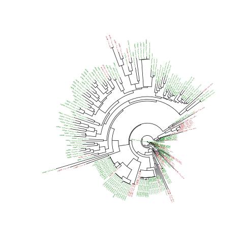

#And online Fungal Foray

This is documentation of my attempts to do a better job of using Genbank to
explore the diversity of fungi in different forests in New Zealand. 

We are starting of with a file `fungal.gb` which contains sequence records
and trying to get something interesting form that

##First glance (what hosts are in there?)

    >>>from Bio import SeqIO
    >>>from scripts.Fungi import Fungi
    >>>f_records = (Fungi(r) for r in SeqIO.parse('fungal.gb', 'gb'))
    >>>hosts = set([r.host for r in f_records])
    >>>len(hosts)
    262

No concerns about having too few hosts then. 

##Are Nothofagus and Pine communities different?

I'm most interested in Nothofagus 
and Pine forests, and only those with ITS sequences (alignable). So lets
get those
    
    >>> def on_target(record):
    ...   if ("Nothofagus" record.host) or ("Pinus" in record.host):
    ...     continue
    ...   else:
    ...     return False
    ...   if record.country != "New Zealand":
    ...     return False
    ...   return record.ITS
    >>> f_records = (Fungi(r) for r in SeqIO.parse('fungal.gb', 'gb'))
    >>> filtered = [r for r in f_records if on_target(r)]
    >>> set([r.host for r in filtered])
    set(['Nothofagus fusca', 'Nothofagus solandri', 'Nothofagus truncata', 'Pinus radiata', 'Nothofagus menziesii', 'Nothofagus sp.'])
    
387 records from Pine or Nothofagus... let's save those a file first
The idea of subclassing SeqRecord for the Fungal record was to be able
to use SeqIO...
  
    >>> SeqIO.write(filtered, 'filtered.gb', 'genbank') 
    207

Magic! 
I'm to make a tree from these, so make the names smaller (readable) and
point them towards a host
    
    >>> to_rename = filtered[:]
    >>> for record in to_rename:
    ...   record.description = record.host
    >>> SeqIO.write(filtered, 'filtered_renamed.fasta', 'fasta')
    207
     
Alright, let's make some trees from the fungal sequences, and see what
they show about the distribution of their hosts

    $ mkdir trees
    $ mv filtered_host.fasta trees/
    $ muscle -in filtered_renamed.fasta -out filtered_renamed_ali.fasta

And then I did a whole lot of tooling around in `R` and using `ape` and
the file `scripts/plot.r` which me this

Which was... OK. But I reckon I can do better with iTOL so I wrote
CSV files to upload there. This one [looks pretty cool](http://itol.embl.de/external.cgi?tree=119224961033146313154072750&restore_saved=1&cT=4689)
and it does look like each community is quite distinct.
